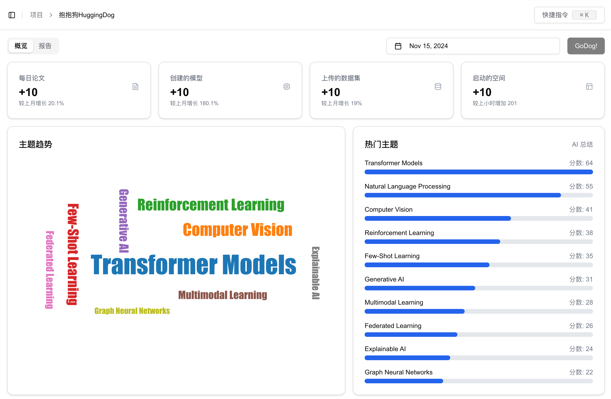
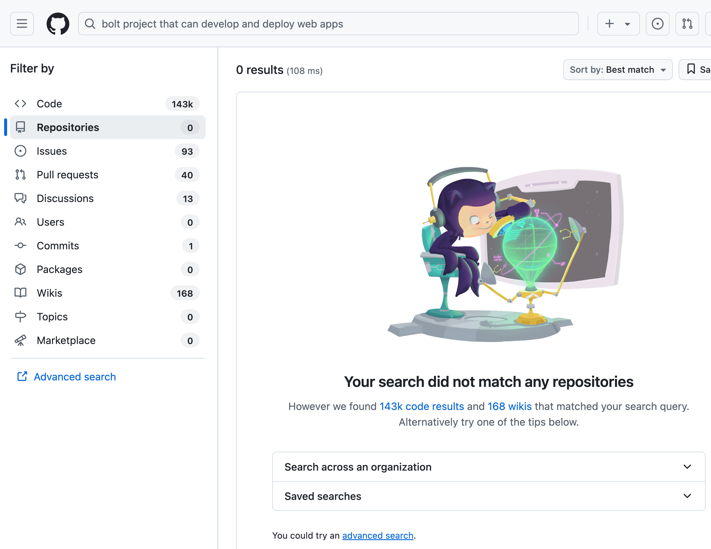
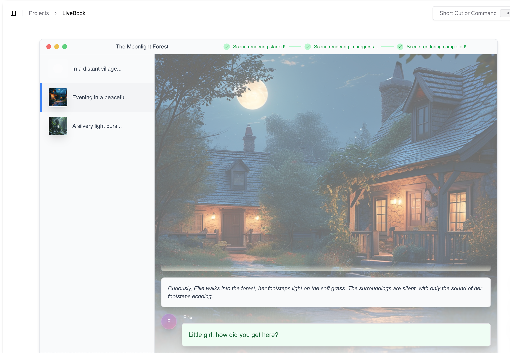
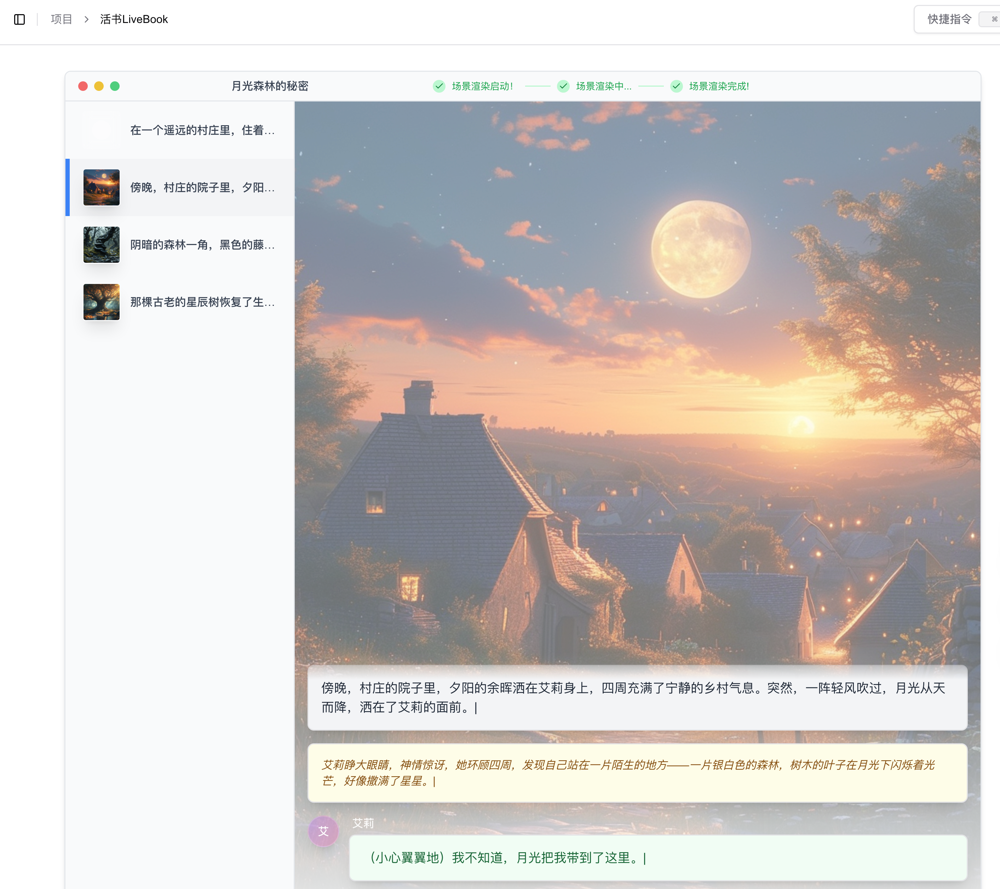

<div align="center">
  <h1>AICoding.live</h1>
  <a href="#huggingdog"> HuggingDog</a> |
  <a href="#askgithub"> AskGitHub</a> |
  <a href="#livebook"> LiveBook</a>
</div>


## A collection of ideas totally implemented by AI. A live experiement, let's see how far they can go.

> ### Human, do not touch the code! Let AI do all the things.

# Contributors

> All contributors are AI, with some joining and some leaving over time

<a href="https://cursor.sh" target="_blank">
  
</a>
<a href="https://claude.ai" target="_blank">
  
</a>
<a href="https://v0.dev" target="_blank">
  
</a>
<a href="https://www.motiff.cn" target="_blank">
  
</a>
<a href="https://www.klingai.com" target="_blank">
  
</a>


# Quick Start

1. Install dependencies

```bash
npm i
npm run dev
```

2. Open [http://localhost:3000](http://localhost:3000) with your browser to see the result.

# Projects

## HuggingDog 

#### Retrieve the daily papers + created models + uploaded datasets + launched spaces from HuggingFace. Also, the discussion and comments from HuggingDog.



## AskGitHub 

#### Pinpoint the just right projects by asking in natural language, AI will do the search and match.

Search on GitHub, you get:



Ask GitHub, you get:


## LiveBook 

#### Bring static book into life, with AIGC.



## More folders have been created...

## Also, welcome to merge your insane ideas done by AI!

---

> ### 一行代码也不写的话，现在的AI Coding可以做到什么程度？

一些好玩的项目合集，一个持续的AI Coding探索性实验；平平无奇, 但（几乎）完全由AI开发维护。

# 贡献者

> 所有贡献者都是AI，随着时间，有的加入，有的退出

<a href="https://cursor.sh" target="_blank">
  
</a>
<a href="https://claude.ai" target="_blank">
  
</a>
<a href="https://v0.dev" target="_blank">
  
</a>
<a href="https://www.motiff.cn" target="_blank">
  
</a>
<a href="https://www.klingai.com" target="_blank">
  
</a>

# 快速开始

1. 安装依赖

```bash
npm i
npm run dev
```

2. 使用浏览器打开 [http://localhost:3000](http://localhost:3000) 查看结果。

# 项目

## HuggingDog 

#### 从 HuggingFace 上自动总结并分析每日论文 + 创建的模型 + 上传的数据集 + 启动的空间。还有抱抱狗的讨论与评论。


## AskGitHub 

#### 通过自然语言询问，AI 将进行搜索和匹配，找到合适的项目。

在 GitHub 上搜索，你会得到：


使用AskGitHub，你会得到：


## LiveBook 

#### 让静态书籍焕发生机，使用 AIGC。



### 其他的已新建文件夹...同时欢迎将你用AI实现的想法与之合并！

